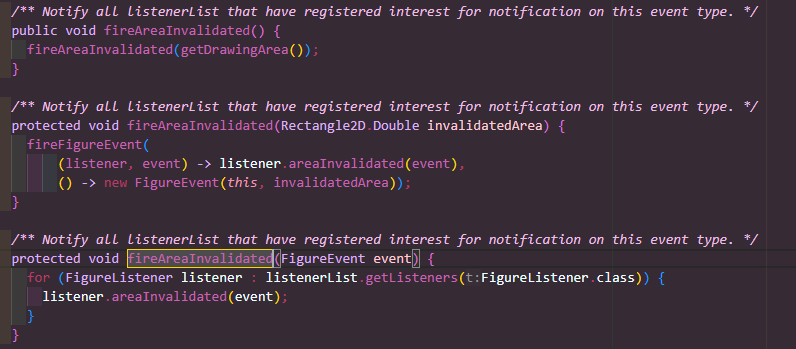

BOUCHIKHI NAGIMA PROJET PART 2 

1 ere modif 

Il existe trois méthodes fireAreaInvalidated avec des signatures différentes 
La troisieme méthode prend un FigureEvent en paramètre, mais son nom ne l'indique pas
Modif apportée : Changement du nom de methode par fireAreaInvalidatedEvent, sans oublier de modif ca dans les classe utilisant cette methode une classe ici